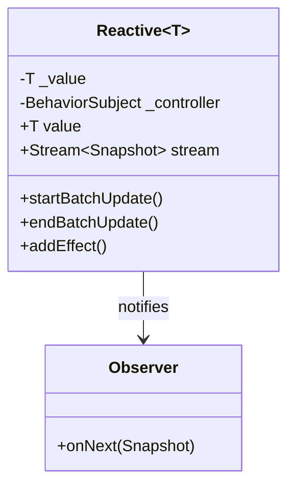
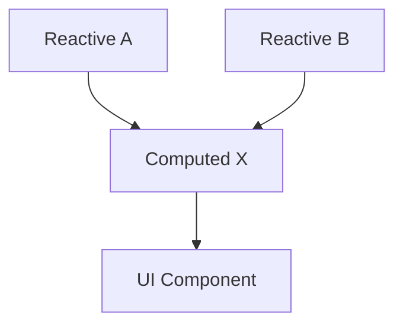
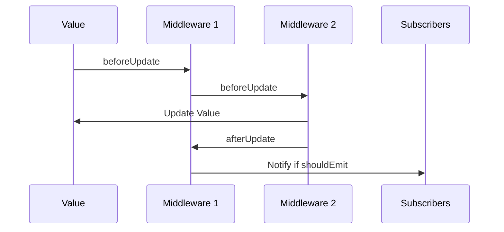
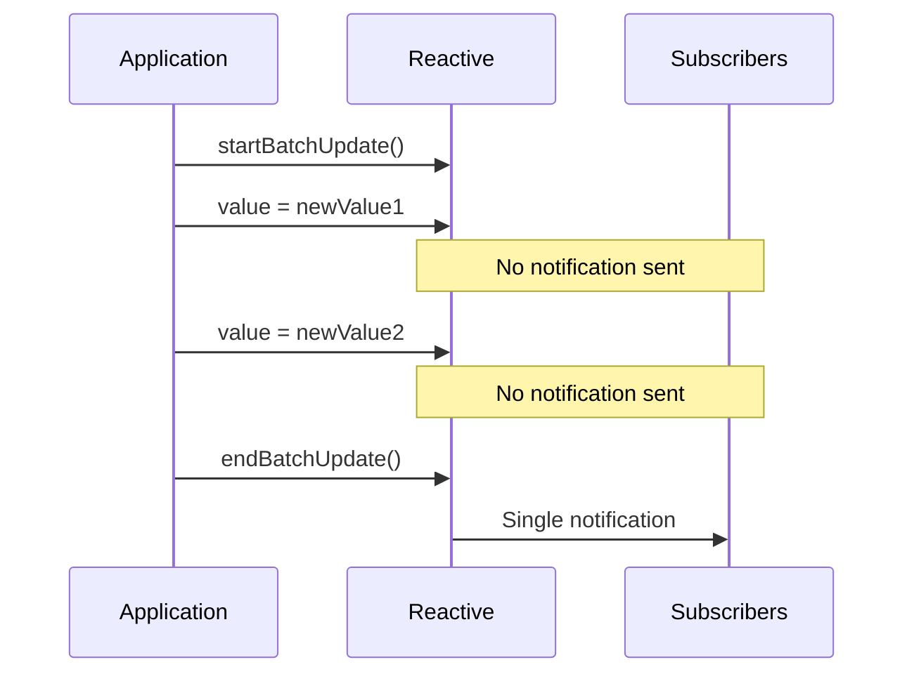
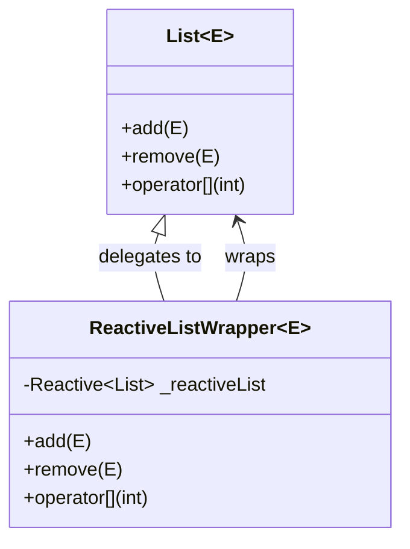
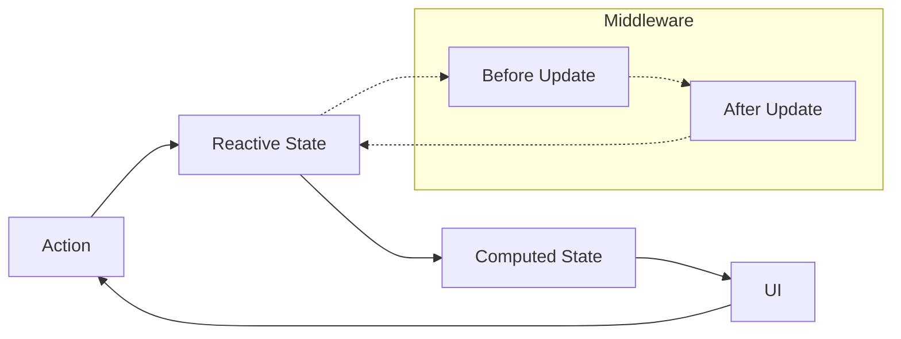
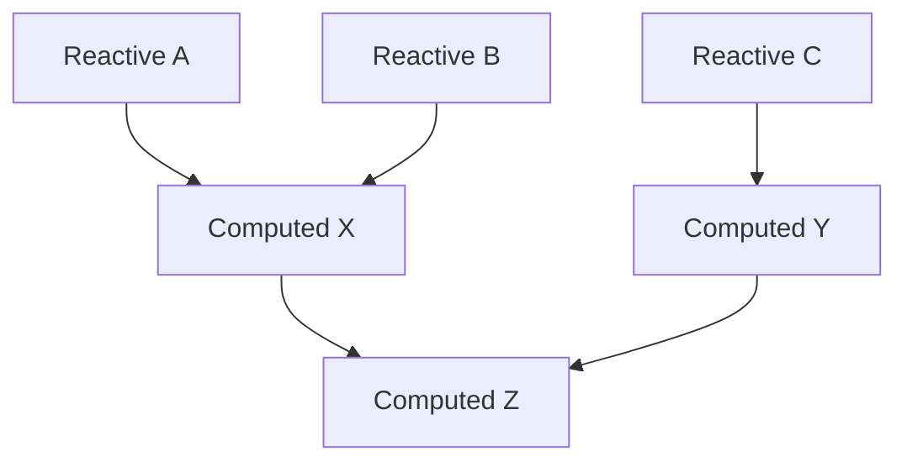
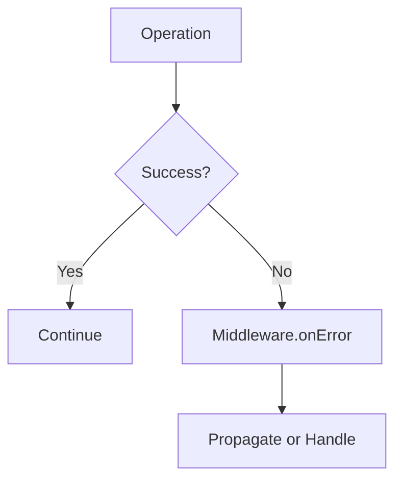

# System Patterns: Fluxivity

## Architectural Overview

Fluxivity implements a reactive programming architecture based on the Observer pattern and functional reactive programming (FRP) principles. The system is built around the following core patterns:

### 1. Observable Pattern

The Observable pattern forms the foundation of Fluxivity's reactivity system:

- **Observable**: Represented by `Reactive<T>` and `Computed<T>`
- **Observer**: Any listener subscribed to the `stream` property
- **Notification**: Delivered via the `Snapshot<T>` objects containing old and new values

This implementation allows for:
- Type-safe reactivity
- Declarative subscriptions
- Granular update notifications

### 2. Computed Properties Pattern

Computed values implement a derivation pattern where values are calculated based on dependencies:

Key aspects:
- Automatic dependency tracking
- Lazy evaluation (compute only when requested)
- Efficient updates (only when dependencies change)
- Caching of computed results

### 3. Middleware Pattern

The middleware pattern enables extensible behavior chains for reactive updates:

This design allows for:
- Separation of concerns
- Extensible behavior
- Aspect-oriented programming techniques
- Pluggable cross-cutting concerns

### 4. Batch Processing Pattern

The batch update pattern allows grouping multiple updates to optimize performance:

Benefits include:
- Reduced notification overhead
- Consistent snapshots
- Atomic updates
- Prevention of UI thrashing

### 5. Reactive Collection Pattern

Collections are made reactive through a delegation and wrapper pattern:

This pattern allows:
- Standard collection API
- Transparent reactivity
- Operation-level notifications
- Efficient collection manipulation

## Data Flow Architecture

Fluxivity implements a unidirectional data flow architecture:

1. **Action**: User interaction or system event triggers a state change
2. **Middleware Processing**: Intercepts updates for processing
3. **State Update**: Reactive state is modified
4. **Propagation**: Changes flow to computed values
5. **Rendering**: UI components respond to state changes

## Composability Model

Fluxivity is designed for composition rather than inheritance:

Components are composed through:
- Function composition
- Stream transformation
- Reactive dependencies
- Middleware chains

This approach facilitates:
- Code reuse
- Testability
- Separation of concerns
- Scalable complexity management

## Error Handling Pattern

Error management follows a consistent pattern throughout the library:

Errors are:
1. Captured in try/catch blocks
2. Passed to middleware for handling
3. Optionally propagated or suppressed
4. Documented in the resulting state

## Implementation Principles

The implementation of Fluxivity adheres to several core principles:

1. **Immutability**: State changes create new snapshots rather than mutating existing state
2. **Transparency**: All reactivity is explicit and visible, avoiding "magic" behavior
3. **Minimal API Surface**: Core functionality is exposed through a small, focused API
4. **Composition Over Inheritance**: Building complex behaviors from simple components
5. **Strong Typing**: Leveraging Dart's type system for safety and editor support
